# 👋 Hi there! I'm MAKaminski

<div align="center">
  
  
  
  ### 🚀 Transforming data into insights, code into solutions
  
  
  
  
  [](https://www.linkedin.com/in/yourlinkedin)
  [](https://michael-kaminski.io)
  
</div>

---

## 🎯 About Me

```python
class DataScientist:
    def __init__(self):
        self.name = "MAKaminski"
        self.role = "Data Scientist & ML Engineer"
        self.passions = ["Machine Learning", "Data Engineering", "Full-Stack Development", "iOS Development"]
        self.current_focus = "Building AI-powered solutions"
        self.favorite_ide = "Cursor AI"  # 🔥 The future of coding!
        self.experience = {
            "enterprise": ["FuboTV - tvOS Engineering Manager", "Stationhead - Lead iOS Developer"],
            "innovation": ["Sonad - FFT/DSP Audio Processing", "Veil of Ignorance - Strategy Game"],
            "social_impact": ["Spotfund - Micro-donations Platform", "Parkarr - Community Parking"]
        }
        
    def say_hi(self):
        print("Thanks for dropping by! Let's build something amazing together! 🚀")
        print(f"Coding with {self.favorite_ide} - where AI meets development! ✨")

me = DataScientist()
me.say_hi()
```

🔭 **Currently working on:** AI/ML projects that make a real-world impact  
🌱 **Learning:** Advanced MLOps, LLM fine-tuning, and distributed systems  
💡 **Ask me about:** Data science, machine learning, Python, iOS development, or any cool tech!  
⚡ **Fun fact:** I can speak fluent SQL to databases and Python to computers  
🎵 **Currently listening to:** 

[](https://open.spotify.com/user/makaminski1)

---

## 📊 GitHub Analytics & Interactive Stats

<div align="center">
  
  
  
  
  
  
  <details>
    <summary>📈 Interactive Detailed Stats & Graphs</summary>
    <br>
    
  
  
  
  
  
  
  ### 📊 Development Stats
  
  
  
  ### 🏆 Achievement Showcase
  
  
    
  </details>
  
  <details>
    <summary>💻 Favorite IDE & Tools</summary>
    <br>
    
  ### 🚀 Primary Development Environment
  
  
  
  
  **Why Cursor?**
  - 🤖 Built-in AI assistance that understands context
  - ⚡ Lightning-fast development with intelligent suggestions
  - 🔍 Advanced code understanding and refactoring
  - 🎯 Perfect for data science and ML workflows
  
  </details>
  
</div>

---

## 🛠️ Tech Arsenal

<details open>
<summary><b>🎨 Frontend Development</b></summary>
<br>


</details>

<details>
<summary><b>📱 Mobile Development</b></summary>
<br>


</details>

<details>
<summary><b>⚙️ Backend & APIs</b></summary>
<br>


</details>

<details>
<summary><b>🤖 Machine Learning & AI</b></summary>
<br>


**🧠 Specialized Skills:**


</details>

<details>
<summary><b>📊 Data Science & Analytics</b></summary>
<br>


</details>

<details>
<summary><b>☁️ Cloud & DevOps</b></summary>
<br>


</details>

<details>
<summary><b>🗄️ Databases & Storage</b></summary>
<br>

**Relational:**


**NoSQL & Vector:**


</details>

---

## 🏆 Featured Projects & Portfolio

<div align="center">

### 🔥 Active Development

<table>
  <tr>
    <td align="center">
      <a href="https://github.com/MAKaminski/SysMemory">
        
      </a>
      <br>
      <strong>🚀 Latest Project</strong><br>
      <em>System memory optimization and monitoring</em>
    </td>
  </tr>
</table>

### 📱 Professional Experience Projects

<table>
  <tr>
    <td align="center" width="50%">
      <h4>🏢 Enterprise & Streaming</h4>
      <br>
      <strong>FuboTV</strong> (Sep 2018 - Present)<br>
      <em>Senior Engineering Manager & Tech Lead</em><br>
      <br>
      
      <br>
      <sub>Sports-first virtual MVPD platform</sub>
    </td>
    <td align="center" width="50%">
      <h4>🎵 Social Media & Music</h4>
      <br>
      <strong>Stationhead</strong> (Aug 2017 - Aug 2018)<br>
      <em>Lead iOS Developer</em><br>
      <br>
      
      <br>
      <sub>Real-time social radio platform</sub>
    </td>
  </tr>
</table>

### 🚀 Innovation & Social Impact

<table>
  <tr>
    <td align="center" width="33%">
      <h4>🔊 Audio Innovation</h4>
      <br>
      <strong>Sonad</strong><br>
      <em>Developer, Co-designer, Database Architect</em><br>
      <br>
      
      
      <br>
      <sub>Shazam meets RetailMeNot using FFT/DSP</sub>
    </td>
    <td align="center" width="33%">
      <h4>🎲 Strategy Gaming</h4>
      <br>
      <strong>Veil of Ignorance</strong><br>
      <em>All Roles</em><br>
      <br>
      
      
      <br>
      <sub>Political philosophy strategy game</sub>
    </td>
    <td align="center" width="33%">
      <h4>🅿️ Community Solutions</h4>
      <br>
      <strong>Parkarr</strong><br>
      <em>Developer, Co-designer, Database Architect</em><br>
      <br>
      
      
      <br>
      <sub>Fast Company 2017 World Changing Ideas Finalist</sub>
    </td>
  </tr>
</table>

### 💡 Entrepreneurial Ventures

<table>
  <tr>
    <td align="center" width="50%">
      <h4>💰 Micro-Donations Platform</h4>
      <br>
      <strong>Spotfund</strong> (Mar 2016 - Nov 2016)<br>
      <em>Lead Developer</em><br>
      <br>
      
      <br>
      <sub>Democratizing giving with $1-3 cap donations</sub>
    </td>
    <td align="center" width="50%">
      <h4>🧠 Mental Health Tech</h4>
      <br>
      <strong>Welli</strong> (Sep 2015 - Oct 2015)<br>
      <em>All Roles</em><br>
      <br>
      
      
      <br>
      <sub>Positive psychology tools suite</sub>
    </td>
  </tr>
</table>

### 📦 Archive & Learning Projects

<table>
  <tr>
    <td align="center">
      <a href="https://github.com/MAKaminski/data_analysis">
        
      </a>
      <br>
      <em>Data science exploration and analysis</em>
    </td>
    <td align="center">
      <a href="https://github.com/MAKaminski/IconGenerator">
        
      </a>
      <br>
      <em>Automated icon generation utility</em>
    </td>
  </tr>
</table>

</div>

---

## 📈 Interactive Skills Graph

```mermaid
graph TD
    A[MAKaminski] --> B[Data Science & ML]
    A --> C[Full-Stack Development]
    A --> D[Mobile Development]
    A --> E[Enterprise Solutions]
    
    B --> B1[Python/TensorFlow]
    B --> B2[MLOps/MLflow]
    B --> B3[LLMs/Transformers]
    B --> B4[FFT/DSP]
    
    C --> C1[React/Redux/Vue]
    C --> C2[Node.js/Python]
    C --> C3[AWS/GCP/Azure]
    C --> C4[PostgreSQL/MongoDB]
    
    D --> D1[iOS/Swift]
    D --> D2[tvOS Development]
    D --> D3[Android/Cross-platform]
    D --> D4[Real-time Apps]
    
    E --> E1[Team Leadership]
    E --> E2[Architecture Design]
    E --> E3[Performance Optimization]
    E --> E4[Scalable Systems]
    
    style A fill:#9400D3,stroke:#333,stroke-width:4px,color:#fff
    style B fill:#FF6F00,stroke:#333,stroke-width:2px
    style C fill:#4285F4,stroke:#333,stroke-width:2px
    style D fill:#34A853,stroke:#333,stroke-width:2px
    style E fill:#EA4335,stroke:#333,stroke-width:2px
```



---

## 🎯 Development Philosophy & Methodologies

<div align="center">

### 🔄 My Development Approach

| Phase | Focus | Tools |
|-------|-------|-------|
| 🎯 **Planning** | Requirements & Architecture | Cursor AI, Miro, Figma |
| 🚀 **Development** | Clean Code & Best Practices | Cursor AI, Git, Docker |
| 🧪 **Testing** | Quality Assurance | Jest, PyTest, XCTest |
| 📊 **Analytics** | Data-Driven Decisions | ML/AI, A/B Testing |
| 🔄 **Optimization** | Performance & Scalability | Profiling, Monitoring |

### 💡 Innovation Metrics


</div>

---

## 📫 Let's Connect & Collaborate!

<div align="center">
  
  **Ready to collaborate on something amazing?**
  
  [](mailto:MKaminski1337@gmail.com)
  [](https://www.linkedin.com/in/yourlinkedin)
  [](https://michael-kaminski.io)
  [](https://cursor.sh)
  
  ### 📊 Real-time Activity
  
  
  
  ---
  
  
  
  ### 🌟 "The best way to predict the future is to create it" - with Cursor AI as my co-pilot! 
  
</div>
