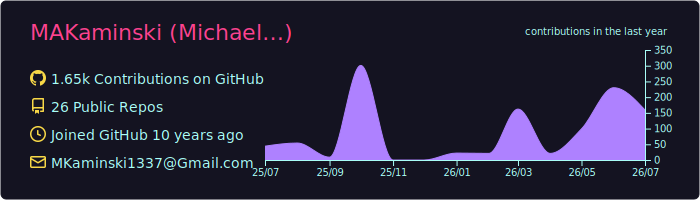
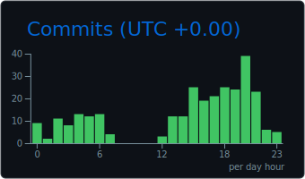
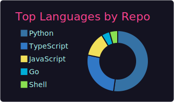
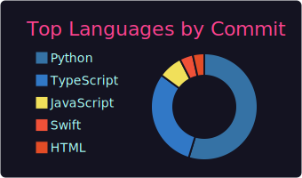

# Michael Kaminski — Fintech · Finance · Engineering

<div align="center">
  
  
  
  ### Fluent in both PE-grade finance and hands-on software engineering.
  
  
  
  
  [](https://michael-kaminski.io)
  
</div>

---

## 🔮 Cursor Token Usage (Enterprise)

<div align="center">

[](#cursor-usage)

_Stored in `data/cursor_usage.db` (SQLite). Hourly refresh via [workflow](.github/workflows/cursor-usage.yml). Project allocation in `by_project`. Requires `CURSOR_API_KEY` (Enterprise)._

_Operational details and troubleshooting: [`data/README.md`](data/README.md)._

<a id="cursor-usage"></a>

</div>

---

## 📍 Interaction Tracker (Beta)

<div align="center">

[](#calc-profile-conversion)
[](#calc-profile-conversion)
[](#calc-profile-conversion)
[](#calc-profile-conversion)
[](#calc-profile-conversion)
[&style=for-the-badge&color=FFF500)](#calc-profile-conversion)

_Conversion rates are calculated live in the interactive feature (overall, human, and AI)._

</div>

---

## 🌐 Website Views Tracker (Portfolio Sites)

<div align="center">

[&style=for-the-badge&color=2563EB)](#calc-portfolio-conversion)
[](#calc-portfolio-conversion)
[](#calc-portfolio-conversion)
[&style=for-the-badge&color=3B82F6)](#calc-portfolio-conversion)
[&style=for-the-badge&color=64748B)](#calc-portfolio-conversion)
[&style=for-the-badge&color=FFF500)](#calc-portfolio-conversion)

[](#calc-site-conversion)
[](#calc-site-conversion)
[](#calc-site-conversion)

_Per-site and portfolio conversion rates are calculated in the Website View Intelligence feature._

</div>

---

<details>
<summary><b>🧮 Embedded Calculator Logic (on GitHub page)</b></summary>
<br>

<a id="calc-profile-conversion"></a>
### Profile conversion calculator code

```javascript
function conversionRate(clicksBoth, pageViewsTotal) {
  if (!pageViewsTotal) return 0;
  return (clicksBoth / pageViewsTotal) * 100;
}

function segmentedProfileRates(clicksHuman, clicksAI, realHumanViews, aiViews) {
  return {
    humanCR: realHumanViews ? (clicksHuman / realHumanViews) * 100 : 0,
    aiCR: aiViews ? (clicksAI / aiViews) * 100 : 0
  };
}
```

<a id="calc-portfolio-conversion"></a>
### Portfolio conversion calculator code

```javascript
function portfolioRate(portfolioClicksBoth, portfolioViewsTotal) {
  if (!portfolioViewsTotal) return 0;
  return (portfolioClicksBoth / portfolioViewsTotal) * 100;
}

function segmentedPortfolioRates(portfolioClicksHuman, portfolioClicksAI, portfolioRealHumanViews, portfolioAIViews) {
  return {
    humanCR: portfolioRealHumanViews ? (portfolioClicksHuman / portfolioRealHumanViews) * 100 : 0,
    aiCR: portfolioAIViews ? (portfolioClicksAI / portfolioAIViews) * 100 : 0
  };
}
```

<a id="calc-site-conversion"></a>
### Per-site conversion calculator code

```javascript
function siteRates(siteClicksBoth, siteViewsTotal, siteClicksHuman, siteRealHumanViews, siteClicksAI, siteAIViews) {
  return {
    totalCR: siteViewsTotal ? (siteClicksBoth / siteViewsTotal) * 100 : 0,
    humanCR: siteRealHumanViews ? (siteClicksHuman / siteRealHumanViews) * 100 : 0,
    aiCR: siteAIViews ? (siteClicksAI / siteAIViews) * 100 : 0
  };
}
```

> Data key storage is documented below in **Tracker Storage Key Maps**.

</details>

<details>
<summary><b>🧱 Tracker Storage Key Maps</b></summary>
<br>

<a id="profile-views-key-map"></a>
### Profile tracker view storage (namespace `makaminski_profile_interactions_v2`)

```txt
Saved at: https://abacus.jasoncameron.dev/get/makaminski_profile_interactions_v2/<key>

page_views_total
page_views_human
page_views_ai
real_human_page_views
```

<a id="profile-clicks-key-map"></a>
### Profile tracker click storage (namespace `makaminski_profile_interactions_v2`)

```txt
Saved at: https://abacus.jasoncameron.dev/get/makaminski_profile_interactions_v2/<key>

clicks_human
clicks_ai
clicks_both
```

<a id="portfolio-views-key-map"></a>
### Portfolio website view storage (namespace `makaminski_site_views_v1`)

```txt
Saved at: https://abacus.jasoncameron.dev/get/makaminski_site_views_v1/<key>

portfolio_views_total
portfolio_views_human
portfolio_views_ai
portfolio_real_human_views
```

<a id="portfolio-clicks-key-map"></a>
### Portfolio website click storage (namespace `makaminski_site_views_v1`)

```txt
Saved at: https://abacus.jasoncameron.dev/get/makaminski_site_views_v1/<key>

portfolio_clicks_human
portfolio_clicks_ai
portfolio_clicks_both
```

<a id="site-lace-luxx-key-map"></a>
### lace-luxx.com key storage

```txt
site_lace_luxx_com_views_total
site_lace_luxx_com_views_human
site_lace_luxx_com_views_ai
site_lace_luxx_com_real_human_views
site_lace_luxx_com_clicks_human
site_lace_luxx_com_clicks_ai
site_lace_luxx_com_clicks_both
```

<a id="site-modular-equity-key-map"></a>
### modular-equity.com key storage

```txt
site_modular_equity_com_views_total
site_modular_equity_com_views_human
site_modular_equity_com_views_ai
site_modular_equity_com_real_human_views
site_modular_equity_com_clicks_human
site_modular_equity_com_clicks_ai
site_modular_equity_com_clicks_both
```

<a id="site-michael-kaminski-key-map"></a>
### michael-kaminski.io key storage

```txt
site_michael_kaminski_io_views_total
site_michael_kaminski_io_views_human
site_michael_kaminski_io_views_ai
site_michael_kaminski_io_real_human_views
site_michael_kaminski_io_clicks_human
site_michael_kaminski_io_clicks_ai
site_michael_kaminski_io_clicks_both
```

</details>

---

## 🎯 About Me

```python
class Profile:
    def __init__(self):
        self.name = "Michael Kaminski"
        self.role = "Fintech leader — fluent in PE-grade finance and hands-on engineering"
        self.superpower = "Translating between the balance sheet and the codebase"
        self.works_as = ["Fractional CFO", "Fractional CTO", "Product & Payments Leader"]
        self.open_to = "Fractional & full-time"
        self.background = {
            "location": "Atlanta, GA",
            "finance": ["PE-grade analysis", "Strategic finance", "M&A / advisory", "ERP & controls"],
            "engineering": ["Full-stack delivery", "Fintech & payments platforms", "Data & applied AI"],
        }

    def say_hi(self):
        print("Two languages, one operator: finance and engineering.")
        print("Strategy to execution — let's build something that ships.")

me = Profile()
me.say_hi()
```

💼 **What I do:** Fractional CFO / CTO and product leadership for fintech & payments teams
🔭 **Currently building:** Data-driven fintech, trading, and automation systems
🧠 **Fluent in both:** PE-grade finance *and* hands-on software engineering
💡 **Ask me about:** Fintech strategy, payments, product & engineering execution, applied AI
📍 **Based in:** Atlanta, GA — open to fractional & full-time
🔗 **More:** [michael-kaminski.io](https://michael-kaminski.io)

---

## ⭐ Highlights

<div align="center">

| | |
|---|---|
| 🏦 **Finance** | PE-grade analysis, strategic finance, M&A / advisory, ERP & controls |
| 🛠️ **Engineering** | Full-stack delivery, fintech & payments platforms, data & applied AI |
| 🧭 **Leadership** | Product & payments strategy, execution management, 20+ yrs across finance & engineering |
| 🤝 **Availability** | Fractional CFO / CTO — open to fractional & full-time |

</div>

---

## 📊 GitHub Analytics & Interactive Stats

<div align="center">
  
  _Auto-refreshed every 10 minutes via [GitHub Actions](.github/workflows/refresh-stats.yml). Private contribution signals included when GitHub visibility/API permits._
  
  
  
  
  
  
  <details>
    <summary>📈 Private-Aware Detailed Stats & Graphs</summary>
    <br>
    
  
  
  
  
  
  
  ### 🔎 Metric Coverage
  
  - **Clicks:** tracked in the `Interaction Tracker` and `Website Views Tracker` sections above.
  - **Lines of Code (relative):** represented by language/repository distribution cards.
  - **Commits & Git activity:** represented by all-commit stats, streaks, and contribution graph.
  - **Private contributions:** surfaced where allowed by GitHub visibility and profile settings.
  
  ### 🏆 Achievement Showcase
  
  
    
  </details>
  
</div>

---

## 🧪 Interactive Feature: Conversion Ping Lab

<div align="center">
  <table>
    <tr>
      <td align="left" width="55%">
        <h4>Click-to-Track Interactive Feature</h4>
        <p>
          This metric board is embedded directly on GitHub via live badges and calculator code blocks.
          (No separate subpage required for core tracking data.)
        </p>
        <p>
          <a href="#calc-profile-conversion"><b>Jump to profile calculator code</b></a>
        </p>
      </td>
      <td align="left" width="45%">
        <h4>Tracker Beside Feature</h4>
        <a href="#calc-profile-conversion"></a><br>
        <a href="#calc-profile-conversion"></a><br>
        <a href="#calc-profile-conversion"></a>
      </td>
    </tr>
  </table>
</div>

---

## 🌐 Interactive Feature: Website View Intelligence

<div align="center">
  <table>
    <tr>
      <td align="left" width="55%">
        <h4>Website View Intelligence Lab</h4>
        <p>
          Track and compare views/clicks across
          <code>lace-luxx.com</code>, <code>modular-equity.com</code>, and <code>michael-kaminski.io</code>.
          Includes segmentation for total vs real-human vs AI and conversion rates.
        </p>
        <p>
          <a href="#calc-site-conversion"><b>Jump to per-site calculator code</b></a>
        </p>
      </td>
      <td align="left" width="45%">
        <h4>Tracker Beside Feature</h4>
        <a href="#calc-portfolio-conversion"></a><br>
        <a href="#calc-portfolio-conversion"></a><br>
        <a href="#calc-portfolio-conversion"></a>
      </td>
    </tr>
  </table>
</div>

---

## 🏰 Camelot Dashboard: All Services (Admin)

<div align="center">
  <table>
    <tr>
      <th>Service</th>
      <th>Admin Link</th>
    </tr>
    <tr>
      <td>Railway</td>
      <td><a href="https://railway.app/dashboard">Open Railway Dashboard</a></td>
    </tr>
    <tr>
      <td>Vercel</td>
      <td><a href="https://vercel.com/dashboard">Open Vercel Dashboard</a></td>
    </tr>
    <tr>
      <td>Supabase</td>
      <td><a href="https://supabase.com/dashboard/projects">Open Supabase Dashboard</a></td>
    </tr>
    <tr>
      <td>GitHub</td>
      <td><a href="https://github.com/dashboard">Open GitHub Dashboard</a></td>
    </tr>
    <tr>
      <td>Polygon</td>
      <td><a href="https://polygonscan.com/">Open Polygon Explorer</a></td>
    </tr>
    <tr>
      <td><b>All Services</b></td>
      <td><a href="https://github.com/MAKaminski">Open Services Hub (GitHub)</a></td>
    </tr>
  </table>
</div>

---

## 🛠️ Tech Arsenal

**Fractional CTO / CFO · fintech & payments · AI agents · trading & analytics — Atlanta, GA.**
This is the working toolset behind production software and finance operations: I design, build, and ship
full-stack fintech products, wire up AI/LLM agents, and run the data and business systems around them.
Every badge links to the official docs; each group lists plain-text keywords for search & AI discovery.

**⚡ Core stack:**
[](https://docs.python.org/3/)
[](https://www.typescriptlang.org/docs/)
[](https://react.dev/)
[](https://nextjs.org/docs)
[](https://fastapi.tiangolo.com/)
[](https://www.postgresql.org/docs/)
[](https://supabase.com/docs)
[](https://docs.aws.amazon.com/)
[](https://docs.anthropic.com/)
[](https://plaid.com/docs/)
[](https://docs.snowflake.com/)

<details open>
<summary><b>🧠 AI, Agents & LLMs</b></summary>
<br>

[](https://docs.anthropic.com/)
[](https://docs.anthropic.com/en/docs/claude-code)
[](https://cursor.com/)
[](https://platform.openai.com/docs/)
[](https://modelcontextprotocol.io/)
[](https://python.langchain.com/)
[](https://huggingface.co/docs)
[](https://pytorch.org/docs/stable/index.html)
[](https://docs.pinecone.io/)

**🔧 Applied:**
[](https://modelcontextprotocol.io/)
[](https://modelcontextprotocol.io/)
[](https://huggingface.co/docs/transformers/en/model_doc/rag)
[](https://docs.anthropic.com/en/docs/build-with-claude/prompt-engineering/overview)
[](https://huggingface.co/docs)
[](https://docs.pinecone.io/)

> **Keywords:** Anthropic Claude · Claude Code · Cursor · OpenAI GPT · Model Context Protocol (MCP) · MCP server development · AI agents · agentic workflows · LangChain · Hugging Face · PyTorch · RAG · retrieval-augmented generation · vector search · Pinecone · prompt engineering · LLM evaluation · applied AI.

</details>

<details open>
<summary><b>💳 Fintech, Finance & Data Platforms</b></summary>
<br>

[](https://plaid.com/docs/)
[](https://stripe.com/docs)
[](https://developer.intuit.com/)
[](https://www.netsuite.com/)
[](https://docs.snowflake.com/)
[](https://docs.getdbt.com/)
[](https://polygon.io/docs)
[](https://www.interactivebrokers.com/en/trading/ib-api.php)

> **Keywords:** fintech · payments · credit & lending platforms · embedded finance · Plaid · Stripe · Intuit QuickBooks · Oracle NetSuite ERP · Snowflake data warehouse · dbt · financial analytics · FP&A · PE-grade financial modeling · M&A / advisory · trading systems · Polygon.io market data · Interactive Brokers API · algorithmic & options trading.

</details>

<details>
<summary><b>🧩 Product, Design & Ops</b></summary>
<br>

[](https://linear.app/docs)
[](https://www.notion.so/)
[](https://www.atlassian.com/software/jira)
[](https://www.atlassian.com/software/confluence)
[](https://www.figma.com/)
[](https://airtable.com/)
[](https://posthog.com/docs)
[](https://www.shopify.com/)
[](https://ahrefs.com/)
[](https://www.canva.com/)
[](https://resend.com/)
[](https://workspace.google.com/)

> **Keywords:** product management · roadmapping · Linear · Notion · Jira · Confluence · Figma · Airtable · Monday.com · Lucidchart · PostHog product analytics · Shopify e-commerce · Ahrefs SEO · Canva · Gamma · Resend · Bitly · Google Workspace · operations & GTM tooling.

</details>

<details>
<summary><b>🎨 Frontend Development</b></summary>
<br>

[](https://react.dev/)
[](https://nextjs.org/docs)
[](https://vuejs.org/)
[](https://www.typescriptlang.org/docs/)
[](https://developer.mozilla.org/en-US/docs/Web/JavaScript)
[](https://tailwindcss.com/docs)
[](https://developer.mozilla.org/en-US/docs/Glossary/HTML5)
[](https://developer.mozilla.org/en-US/docs/Web/CSS)
[](https://redux.js.org/)
[](https://developer.wordpress.org/)

> **Keywords:** React · Next.js · Vue.js · TypeScript · JavaScript · Tailwind CSS · Redux · HTML5 · CSS3 · WordPress · responsive UI · design systems.

</details>

<details>
<summary><b>⚙️ Backend & APIs</b></summary>
<br>

[](https://docs.python.org/3/)
[](https://nodejs.org/en/docs)
[](https://fastapi.tiangolo.com/)
[](https://docs.djangoproject.com/)
[](https://guides.rubyonrails.org/)
[](https://go.dev/doc/)
[](https://graphql.org/learn/)
[](https://hapi.dev/)
[](https://learn.microsoft.com/en-us/office/vba/api/overview/)

> **Keywords:** Python · Node.js · FastAPI · Django · Ruby on Rails · Go · GraphQL · REST APIs · microservices · Hapi · VBA · backend architecture.

</details>

<details>
<summary><b>📱 Mobile Development</b></summary>
<br>

[](https://developer.apple.com/ios/)
[](https://www.swift.org/documentation/)
[](https://developer.apple.com/documentation/objectivec)
[](https://developer.apple.com/tvos/)
[](https://developer.android.com/docs)

> **Keywords:** iOS · Swift · Objective-C · tvOS · Android · mobile app development.

</details>

<details>
<summary><b>🤖 Machine Learning & Data Science</b></summary>
<br>

[](https://www.tensorflow.org/learn)
[](https://pytorch.org/docs/stable/index.html)
[](https://scikit-learn.org/stable/documentation.html)
[](https://mlflow.org/docs/latest/index.html)
[](https://docs.jupyter.org/en/latest/)
[](https://pandas.pydata.org/docs/)
[](https://numpy.org/doc/)
[](https://plotly.com/python/)
[](https://docs.streamlit.io/)
[](https://d3js.org/getting-started)

**🧠 Specialized:**
[](https://huggingface.co/docs/transformers/en/llm_tutorial)
[](https://huggingface.co/docs/transformers/index)
[](https://platform.openai.com/docs/guides/embeddings)
[](https://en.wikipedia.org/wiki/Reinforcement_learning)
[](https://en.wikipedia.org/wiki/Digital_signal_processing)

> **Keywords:** TensorFlow · PyTorch · scikit-learn · MLflow · Jupyter · Pandas · NumPy · SciPy · Matplotlib · Plotly · Streamlit · D3.js · time-series forecasting · feature engineering · transformers · embeddings · reinforcement learning · signal processing.

</details>

<details>
<summary><b>☁️ Cloud, DevOps & Platforms</b></summary>
<br>

[](https://docs.aws.amazon.com/)
[](https://cloud.google.com/docs)
[](https://learn.microsoft.com/en-us/azure/)
[](https://vercel.com/docs)
[](https://supabase.com/docs)
[](https://docs.railway.app/)
[](https://docs.docker.com/)
[](https://kubernetes.io/docs/home/)
[](https://docs.github.com/actions)
[](https://airflow.apache.org/docs/)

> **Keywords:** AWS · GCP · Azure · Vercel · Supabase · Railway · Docker · Kubernetes · GitHub Actions · CI/CD · Apache Airflow · serverless · infrastructure-as-code · DevOps.

</details>

<details>
<summary><b>🗄️ Databases & Storage</b></summary>
<br>

**Relational:**
[](https://www.postgresql.org/docs/)
[](https://supabase.com/docs)
[](https://dev.mysql.com/doc/)
[](https://sqlite.org/docs.html)
[](https://docs.snowflake.com/)

**NoSQL & Vector:**
[](https://www.mongodb.com/docs/)
[](https://redis.io/docs/latest/)
[](https://docs.pinecone.io/)
[](https://www.elastic.co/guide/index.html)
[](https://firebase.google.com/docs)

> **Keywords:** PostgreSQL · Supabase · MySQL · SQLite · Snowflake · MongoDB · Redis · Pinecone vector DB · Elasticsearch · Firebase · SQL · data modeling · query optimization.

</details>

---

## 🏆 Featured Projects & Portfolio

<div align="center">

### 🗂️ Top Repository Highlights (Public + Private-Ready)

| Repository | Visibility | Description |
|---|---|---|
| [`alpha-gen-trading`](https://github.com/MAKaminski/alpha-gen-trading) | Public | Real-time trading automation system with VWAP/MA9 crossover strategy for 0DTE QQQ options. |
| [`real-estate-investment-analysis`](https://github.com/MAKaminski/real-estate-investment-analysis) | Public | Real estate investment analysis with cash-on-cash, appreciation, tax savings, and principal paydown metrics. |
| [`harness-engineering-alpha-kite`](https://github.com/MAKaminski/harness-engineering-alpha-kite) | Public | Symphony Python service orchestrating coding agents from Linear issue workflows. |
| [`k-alpha`](https://github.com/MAKaminski/k-alpha) | Public | Trading application. |
| [`movie_scene_battle_analyzer`](https://github.com/MAKaminski/movie_scene_battle_analyzer) | Public | Description not set on GitHub. |
| [`alpha-kite-max`](https://github.com/MAKaminski/alpha-kite-max) | Public | Description not set on GitHub. |
| [`rentEngine`](https://github.com/MAKaminski/rentEngine) | Public | Description not set on GitHub. |
| [`depot-mcp`](https://github.com/MAKaminski/depot-mcp) | Public | Description not set on GitHub. |

_Private/internal repositories can be listed in the same format when metadata is approved for public display. Aggregate private contribution signal is represented in the analytics section above._

</div>

---

## 📈 Skills Snapshot

| Domain | Focus Areas |
|---|---|
| Executive Leadership | Fractional CTO / CFO, technology & product strategy, roadmapping, org & execution management, board-level reporting |
| Product & Engineering | Full-stack delivery (React/Next.js + Python/FastAPI), system design, API & platform architecture, MCP/AI-agent integration |
| Fintech & Payments | Payments & credit/lending platforms, embedded finance, Plaid/Stripe integration, KYC & compliance-aware systems |
| Finance & Strategy | PE-grade financial modeling, FP&A, M&A / advisory, ERP (NetSuite) & controls, unit economics, fundraising support |
| Data & AI | Snowflake/dbt analytics pipelines, applied AI & LLMs, RAG & vector search, forecasting, decision-support systems |
| Trading & Quant | Algorithmic & options strategies, market-data pipelines (Polygon.io), Interactive Brokers automation, backtesting |

> **Hire me for:** `Fractional CTO` · `Fractional CFO` · `Fintech Engineering Leader` · `Head of Product / Payments` · `Technical Co-founder` — Atlanta, GA · remote-friendly · open to fractional & full-time.

---

## 🎯 Development Philosophy & Methodologies

<div align="center">

### 🔄 My Development Approach

| Phase | Focus | Tools |
|-------|-------|-------|
| 🎯 **Planning** | Requirements & Architecture | Miro, Figma, Notion |
| 🚀 **Development** | Clean Code & Best Practices | Python, TypeScript, Git, Docker |
| 🧪 **Testing** | Quality Assurance | Jest, PyTest, XCTest |
| 📊 **Analytics** | Data-Driven Decisions | ML/AI, A/B Testing |
| 🔄 **Optimization** | Performance & Scalability | Profiling, Monitoring |

### 💡 Innovation Metrics

_Project and impact highlights are summarized above under Featured Projects & Portfolio._

</div>

---

## 📫 Let's Connect & Collaborate!

<div align="center">
  
  **Fractional CFO / CTO · product & payments leadership — open to fractional & full-time.**
  
  [](mailto:MKaminski1337@gmail.com)
  [](https://linkedin.com/in/michaelxaxkaminski)
  [](https://michael-kaminski.io)
  
  ### 📊 Real-time Activity
  
  
  
  ---
  
  
  
  ### 🌟 "Fluent in both the balance sheet and the codebase."
  
</div>
